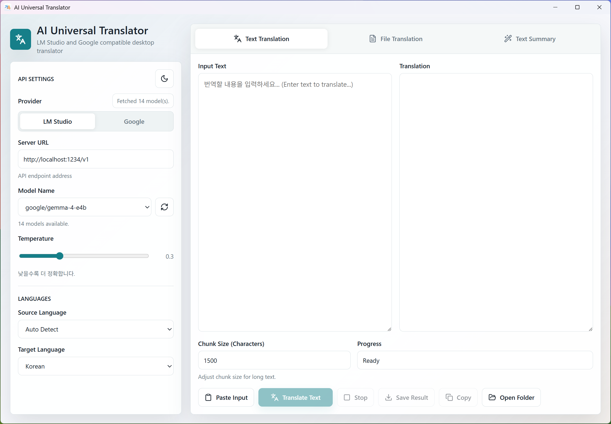

# AI Universal Translator

AI Universal Translator is a desktop translation and summarization app built with Tauri, Rust, TypeScript, and React.

The app supports OpenAI-compatible chat completion APIs, including local LM Studio servers and Google's Gemini OpenAI-compatible endpoint.



## Features

- Text translation with streaming output
- Text summarization with streaming output
- UTF-8 text file translation
- Automatic chunking for long text and large files
- LM Studio and Google provider modes
- LM Studio model list auto-sync from `/models`
- Secure Google API key storage via Windows Credential Manager
- Automatic API key migration from `gemini.txt`
- Source language auto-detection option
- Adjustable temperature and chunk size
- Stop/cancel controls for running tasks
- Copy, paste, and save result actions
- Automatic sequential file naming (e.g., `translated001.txt`)
- Open local `./output` folder directly from the app
- Light and dark theme toggle

## Tech Stack

- Tauri 2
- Rust
- React
- TypeScript
- Vite
- lucide-react

## Requirements

- Node.js 20 or newer
- npm
- Rust toolchain
- LM Studio running with a local server, or a Google Gemini API key

For LM Studio, the default API base URL is:

```text
http://localhost:1234/v1
```

For Google, the app uses:

```text
https://generativelanguage.googleapis.com/v1beta/openai/
```

### 📥 Download
You can download the latest version from the [Releases Page](https://github.com/kirinonakar/AItranslator/releases).

## Manual Build

Install dependencies:

```bash
npm install
```

Run the Tauri desktop app in development mode:

```bash
npm run tauri:dev
```

Run only the Vite frontend for UI development:

```bash
npm run dev
```

Build the frontend:

```bash
npm run build
```

Build the desktop app:

```bash
npm run tauri:build
```

## Provider Setup

### LM Studio

1. Open LM Studio.
2. Start the local server.
3. Confirm the server is available at `http://localhost:1234/v1`.
4. Click the model sync button in the app to fetch available models.

### Google Gemini

You can enter the API key directly in the app. For security, the key is stored in the **Windows Credential Manager** and automatically loaded when the app starts. 

For convenience, you can also place the key in a `gemini.txt` file at the project root; the app will automatically import it into the Credential Manager on the next launch.

The Google provider mode switches the model list to the bundled Gemini/Gemma model options and locks the base URL to Google's OpenAI-compatible endpoint.

## Supported Languages

Source languages:

- Auto Detect
- English
- Korean
- Japanese
- Chinese
- Spanish
- French
- German
- Russian

Target languages:

- English
- Korean
- Japanese
- Chinese
- Spanish
- French
- German
- Russian

## Supported File Types

The file translation view accepts UTF-8 text-based files:

- `.txt`
- `.md`
- `.py`
- `.js`
- `.html`
- `.json`
- `.csv`

Translated and saved files are stored in the `./output` directory within the project folder. The app automatically increments filenames (e.g., `filename001.txt`, `filename002.txt`) to prevent overwriting existing results.

## Project Structure

```text
.
├── index.html             # Vite entry HTML
├── output/                # Translated and saved files
├── package.json           # Frontend and Tauri scripts
├── src/                   # React + TypeScript frontend
│   ├── App.tsx
│   ├── constants.ts
│   ├── main.tsx
│   ├── styles.css
│   └── types.ts
└── src-tauri/             # Tauri + Rust backend
    ├── Cargo.toml
    ├── build.rs
    ├── tauri.conf.json
    ├── capabilities/
    ├── icons/
    └── src/
        └── main.rs
```

## Development Notes

The Rust backend owns the API calls, streaming response parsing, chunk splitting, cancellation state, and temporary file writes. The React frontend owns the application state, provider controls, tabs, theme toggle, clipboard interactions, and result display.

Streaming responses are emitted from Rust to the frontend through Tauri events.

## License

This project is licensed under the MIT License - see the [LICENSE](LICENSE) file for details.

